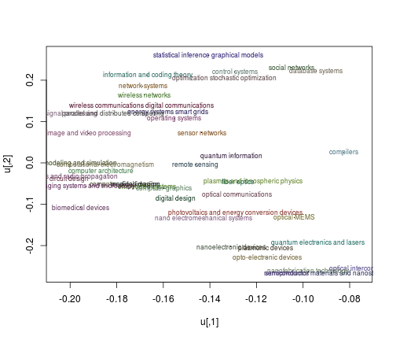
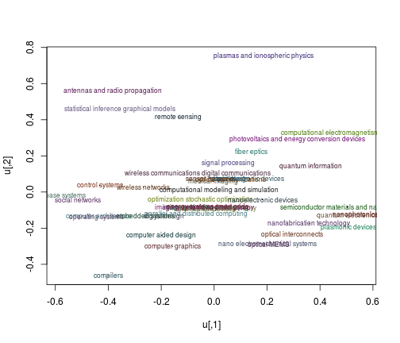
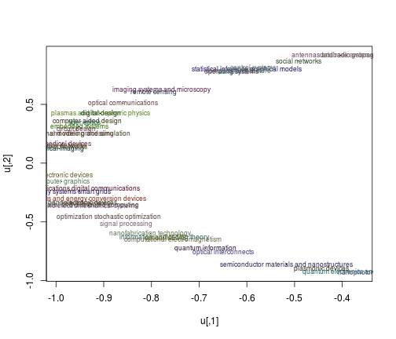

Charles Zheng EE 378b HW 2
========================================================

# Method:

Define a distance metric as follows:
$$
d(x, y) = 1 - \frac{\sum_i x_i y_i I_{x_i \neq NA}I_{y_i \neq NA}}{
\sqrt{\sum_i x_i^2 I_{x_i \neq NA}}
\sqrt{\sum_i y_i^2 I_{y_i \neq NA}}
}
$$

Let $S$ be the 44 x 44 matrix of pairwise distances.
Define $A = \exp(-S/(2\sigma^2))$ and define the Laplacian as
$L = I - D^{-1/2}A D^{-1/2}$.
Compute the $d$ smallest eigenvectors of the Laplacian and use $k$-means.

# Setup

Loading the data:


```r
set.seed(0)
tab <- read.csv("anon.csv", header = FALSE, row.names = 1)
colnames(tab) <- paste0("V", 1:63)
dim(tab)
```

```
## [1] 44 63
```

Define the following functions for plotting:

```r
cols <- rgb(runif(44) * .5, runif(44) * .5, runif(44) * .5)

plotfunc <- function(u) {
  plot(u, pch = '.')
  for (i in 1:44) {
    text(
      u[i, 1], u[i, 2], rownames(tab)[i],
      cex = .7, col = cols[i])
  }
}
```

The distance function:

```r
cust_dist <- function(x, y) {
  inds <- which(!is.na(x) & !is.na(y))
  x2 <- x[inds]
  y2 <- y[inds]
  x2 <- x2/sqrt(sum(x2^2))
  y2 <- y2/sqrt(sum(y2^2))
  1 - sum(x2 * y2)
}
```

Before using spectral projection, take a look at linear projection.

# Linear projection

## Euclidean distance with softimpute


```r
library(softImpute)
x <- as.matrix(tab)
fits <- softImpute(x, type="svd", lambda = 2, rank.max = 2)
dim(fits$u) # 44 2
```

```
## [1] 44  2
```

```r
x2 <- complete(x, fits)
res <- svd(x2)
plotfunc(fits$u)
```

 


## Custom distance with MDS


```r
dm <- matrix(0, 44, 44)
for (i in 1:44) {
  for (j in 1:44) {
    dm[i, j] <- cust_dist(x[i, ], x[j, ])
  }
}
fit <- cmdscale(dm)
plotfunc(fit)
```

 

# Spectral clustering

## Form the laplacian


```r
form_laplacian <- function(dm, sigma2) {
  amat00 <- exp(-dm/(2 * sigma2))
  ds <- apply(amat00, 1, sum)
  amat01 <- diag(1/sqrt(ds)) %*% amat00 %*% diag(1/sqrt(ds))
  amat <- diag(rep(1, dim(amat)[1])) - amat01
}
sigma2 <- 0.1
amat <- form_laplacian(dm, sigma2)
```

Function to find Laplacian coordinates.

```r
laplacian_coords <- function(amat, d = 2) {
  amat01 <- diag(rep(1, dim(amat)[1])) - amat
  res <- eigen(amat01)
  coords0 <- res$vectors[, 1:d]
  coords <- t(apply(coords0, 1, function(v) v/sqrt(sum(v^2))))
}
coords <- laplacian_coords(amat)
plotfunc(coords)
```

 

## Get the clusters


```r
print_cluster <- function(res) {
  k <- max(res$cluster)
  for (i in 1:k) {
    cat(paste("=== Cluster", i, " ===\n"))
    cat(paste(rownames(x)[res$cluster == i], collapse = "\n"))
    cat("\n\n")
  }
}

k <- 3
res <- kmeans(coords, k)
print_cluster(res)
```

```
## === Cluster 1  ===
## network systems
## wireless communications digital communications
## information and coding theory
## signal processing
## optimization stochastic optimization
## energy systems smart grids
## nanoelectronic devices
## optical interconnects
## nanofabrication technology
## photovoltaics and energy conversion devices
## nano electromechanical systems
## semiconductor materials and nanostructures
## nanophotonics
## quantum electronics and lasers
## quantum information
## parallel and distributed computing
## computational electromagnetism
## plasmonic devices
## optical MEMS
## 
## === Cluster 2  ===
## social networks
## control systems
## statistical inference graphical models
## computer architecture
## operating systems
## compilers
## remote sensing
## antennas and radio propagation
## imaging systems and microscopy
## database systems
## 
## === Cluster 3  ===
## wireless networks
## sensor networks
## image and video processing
## medical imaging
## biomedical devices
## opto-electronic devices
## computational modeling and simulation
## circuit design
## digital design
## embedded systems
## computer aided design
## computer graphics
## plasmas and ionospheric physics
## fiber optics
## optical communications
```

## Try different $d$ and $k$

Try different $d$ and $k$ to get the best clusters.

### $d = 2$, $k = 9$


```r
coords <- laplacian_coords(amat, 2)
res <- kmeans(coords, 9)
print_cluster(res)
```

```
## === Cluster 1  ===
## semiconductor materials and nanostructures
## plasmonic devices
## 
## === Cluster 2  ===
## information and coding theory
## signal processing
## optimization stochastic optimization
## nanofabrication technology
## computational electromagnetism
## optical MEMS
## 
## === Cluster 3  ===
## nanophotonics
## quantum electronics and lasers
## 
## === Cluster 4  ===
## network systems
## wireless communications digital communications
## energy systems smart grids
## nanoelectronic devices
## opto-electronic devices
## photovoltaics and energy conversion devices
## nano electromechanical systems
## parallel and distributed computing
## computer graphics
## 
## === Cluster 5  ===
## circuit design
## digital design
## embedded systems
## computer aided design
## plasmas and ionospheric physics
## fiber optics
## 
## === Cluster 6  ===
## wireless networks
## sensor networks
## image and video processing
## medical imaging
## biomedical devices
## computational modeling and simulation
## 
## === Cluster 7  ===
## remote sensing
## optical communications
## imaging systems and microscopy
## 
## === Cluster 8  ===
## optical interconnects
## quantum information
## 
## === Cluster 9  ===
## social networks
## control systems
## statistical inference graphical models
## computer architecture
## operating systems
## compilers
## antennas and radio propagation
## database systems
```

### $d = 3$, $k = 9$


```r
coords <- laplacian_coords(amat, 3)
res <- kmeans(coords, 9)
print_cluster(res)
```

```
## === Cluster 1  ===
## statistical inference graphical models
## antennas and radio propagation
## optical communications
## 
## === Cluster 2  ===
## information and coding theory
## optical interconnects
## optical MEMS
## 
## === Cluster 3  ===
## medical imaging
## computational modeling and simulation
## digital design
## embedded systems
## computer aided design
## 
## === Cluster 4  ===
## wireless networks
## image and video processing
## biomedical devices
## computer graphics
## 
## === Cluster 5  ===
## social networks
## control systems
## computer architecture
## operating systems
## compilers
## imaging systems and microscopy
## database systems
## 
## === Cluster 6  ===
## wireless communications digital communications
## signal processing
## nanoelectronic devices
## opto-electronic devices
## nanofabrication technology
## photovoltaics and energy conversion devices
## semiconductor materials and nanostructures
## computational electromagnetism
## 
## === Cluster 7  ===
## network systems
## optimization stochastic optimization
## energy systems smart grids
## nano electromechanical systems
## parallel and distributed computing
## 
## === Cluster 8  ===
## nanophotonics
## quantum electronics and lasers
## quantum information
## plasmonic devices
## 
## === Cluster 9  ===
## sensor networks
## circuit design
## remote sensing
## plasmas and ionospheric physics
## fiber optics
```

### $d = 4$, $k = 9$


```r
coords <- laplacian_coords(amat, 4)
res <- kmeans(coords, 9)
print_cluster(res)
```

```
## === Cluster 1  ===
## nanoelectronic devices
## opto-electronic devices
## nanofabrication technology
## semiconductor materials and nanostructures
## 
## === Cluster 2  ===
## image and video processing
## control systems
## computational modeling and simulation
## operating systems
## compilers
## 
## === Cluster 3  ===
## computer architecture
## digital design
## embedded systems
## computer aided design
## optical communications
## 
## === Cluster 4  ===
## social networks
## imaging systems and microscopy
## database systems
## 
## === Cluster 5  ===
## optical interconnects
## nano electromechanical systems
## parallel and distributed computing
## computer graphics
## plasmonic devices
## optical MEMS
## 
## === Cluster 6  ===
## network systems
## wireless networks
## information and coding theory
## optimization stochastic optimization
## energy systems smart grids
## biomedical devices
## 
## === Cluster 7  ===
## wireless communications digital communications
## sensor networks
## signal processing
## medical imaging
## photovoltaics and energy conversion devices
## computational electromagnetism
## 
## === Cluster 8  ===
## nanophotonics
## quantum electronics and lasers
## quantum information
## 
## === Cluster 9  ===
## statistical inference graphical models
## circuit design
## remote sensing
## plasmas and ionospheric physics
## antennas and radio propagation
## fiber optics
```
