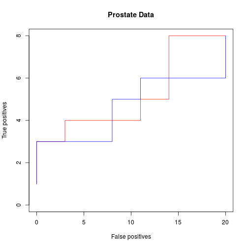

## Introduction

Consider the variable selection problem as a ranking problem.

## Example: Prostate Data


```r
library(reginference)
data(prostate)
x <- prostate[, 1:8]
y <- prostate[, 9]
x_false <- noised_projections(x, sigma = 0.1, q = 20)
x_aug <- cbind(x, x_false)
```

Knockoffs


```r
list_knockoffs <- function(x, y) {
  res <- knockoff::knockoff.filter(x, y , fdr = 0.2)
  stats <- res$statistic
  names(stats) <- colnames(x_aug)
  list_k <- names(stats[order(-stats)])
  list_k  
}

list_k <- list_knockoffs(x_aug, y)
```

LASSO


```r
list_lasso <- function(x, y) {
  resLARS <- lars::lars(as.matrix(x), y)
  names(unlist(resLARS$actions))
  list_l <- unique(names(unlist(resLARS$actions)))
  list_l
}

list_l <- list_lasso(x_aug, y)
```

Plot AUC curves

```r
plot_AUC <- function(namelist, append = FALSE, ...) {
  p <- length(namelist)
  fps <- sapply(namelist, function(v) substr(v, 1, 3) == "Neg")
  p0 <- sum(fps)
  p1 <- p - p0
  if (!append) plot(NA, NA, xlim = c(0, p0), ylim = c(0, p1),
                    xlab = "False positives", ylab = "True positives")
  fpr <- cumsum(fps)
  tpr <- cumsum(1 - fps)
  lines(fpr, tpr, ...)
}
plot_AUC(list_l, col = "red")
plot_AUC(list_k, append = TRUE, col = "blue")
title("Prostate Data")
```

 
